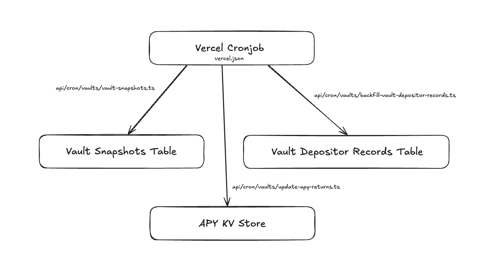

# Vaults UI Template

A simple fullstack template for vaults - includes a NextJS UI supported by a NextJS + Vercel backend.

### High-level Code Structure

```
- repo
  - drift-common (git submodule)
    - protocol
      - sdk
    - common-ts
    - react
    - icons
  - ui
```

### Setup

1. If you didn't clone this repo with the `--recursive` flag, first run `git submodule update --init`. This will pull down the latest commit in the `drift-common` submodule.
2. Run `cd drift-common && git submodule update --init && cd ..` to pull the latest from the `protocol` submodule.
3. Run `./build_all_sm.sh` - this builds and symlinks all of the local libraries
   - In case this doesn't work. `build_all_sm.sh` is just building and symlinking all of the necessary packages in the `drift-common` submodule : `drift-common/icons`, `drift-common/react`, and `drift-common/common-ts`, so you may be able to do this yourself manually or debug the issue.
4. In the future if you need to rebuild modules, just run `./build_all_sm.sh` again.
5. Make sure to checkout `master` branch for the submodules.

### Setup Vercel

1. Add the project to Vercel.
2. Add the custom install command: `bun run install-vercel`
3. Add the custom build command: `bun run build-vercel`
4. Deploy the project

## Backend Overview

The entire backend is based on solutions from Vercel + NextJS. The backend mainly supports the following:

- Vault Performance History
- Vault Depositor Performance History (extrapolated from Vault Performance History)
- Vault semi-live APY calculation


_Backend architecture overview showing the relationship between components_

#### Vault Performance History

A cronjob is set to run every midnight (UTC) to take a snapshot of the vault's metrics - e.g. TVL, total shares, main spot market oracle price etc. These information can be used to construct a vault's performance history graph.

#### Vault Depositor Performance History

A cronjob is set to run every minute to port any vault depositor record event from the blockchain. Events include deposits, withdrawal requests, request cancellation and withdrawals. With this data, combined with the vault performance history, we can extrapolate the vault depositor's performance history.

#### Vault Semi-live APY Calculation

A cronjob is set to run every hour to calculate the vault's APY. We only calculate and cache the APY every hour, since it requires reading the vault's snapshot history every time it calculates the APY.

_All parameters of the cronjobs are subjective. Feel free to adjust according to your needs._

### Setup Database

We use Vercel Postgres for our database, with Drizzle as our ORM.

1. Create a new Vercel Postgres database.
2. Connect the project to the database, and copy the Postgres secrets into your `.env` file.
3. Delete the `./ui/db-migrations` directory.
4. Run `bun run migrate-db` in `./ui` to generate the new migrations for your new database.

### Setup KV Store

We use Vercel KV for caching, mainly for the vault's calculated APY.

1. Create a new Vercel KV database.
2. Connect the project to the database, and copy the KV secrets into your `.env` file.

### Setup Cron Jobs

**Cronjobs are only run on the production branch.** Cronjobs are essentially NextJS API routes that are called on a schedule based on `vercel.json`.

1. Add the `CRON_SECRET` to your `.env` file. This should be a random string of characters. This ensures that your cronjobs are protected from being called by anyone. Ensure that this is set in your Vercel environment variables.
2. Add `NEXT_PUBLIC_RPC_OVERRIDE` to your `.env` file. This should be the RPC URL of the cluster you are using.
3. You may edit the cronjobs in `vercel.json` to run on a different schedule, suited to your needs.
4. Push any changes to the cronjob schedule/API routes to the production branch to ensure the changes are in effect.

_Ensure all environment variables are reflected on your local machine and in Vercel._
